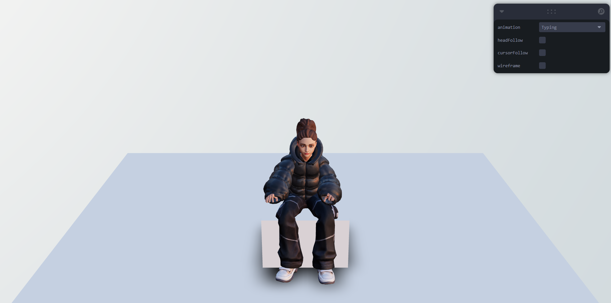

# React 3D persone

A modern web application built with **React**, **Three.js** allowing users to interact with 3D objects and explore a map-based interface directly in the browser.

---

## 🚀 Features

- 🌐 Interactive 3D scenes powered by Three.js

---

## 📦 Installation

Follow these steps to get the project up and running locally:

1. **Clone the repository:**
   ```
   git clone https://github.com/DmitryFullStackDev/threeReact.git
   cd 3dPersone https://github.com/DmitryFullStackDev/3dPersone.git
   ```

2. **Install dependencies:**
   ```
   npm install
   ```

3 **Start the development server:**
   ```
    npm run dev
   ```

## 💻 Usage
Once the server is running, open your browser at http://localhost:5173 (or the port shown in your terminal).

- 🌀 Drag or click to interact with 3D elements.

## 🧪 Tech Stack
- React – Frontend framework
- Three.js – 3D graphics rendering

## ✨ Demo
Experience the app simulation live:
https://3d-persone.vercel.app/ 🔥

## 🧩Interface

